# Storytelling Podcast Backend

> 將英文書籍章節轉換為教學風格的單人旁白播客系統

[](https://www.python.org/downloads/)
[](https://fastapi.tiangolo.com/)
[](https://opensource.org/licenses/MIT)

## 核心特性

- 📝 **智能腳本生成** - 使用 Gemini 2.5 Pro 將書籍章節轉換為教學風格播客腳本
- 🎙️ **高質量 TTS** - Gemini Multi-Speaker TTS 生成自然流暢的單人旁白音頻
- 📊 **詞級精準字幕** - Montreal Forced Aligner 實現毫秒級字幕對齊
- 🌐 **逐句翻譯** - 整合 Google Translation API 提供多語言支持
- 🚀 **FastAPI 服務** - RESTful API 供前端應用消費
- ⚙️ **靈活配置** - 支持多語言等級（A2-C1）、長度模式、語速調整

## 快速開始

### 10 分鐘上手

```bash
# 1. 克隆倉庫
git clone <your-repo-url>
cd storytelling-backend

# 2. 創建虛擬環境並安裝依賴
python3 -m venv .venv
source .venv/bin/activate
pip install -r requirements/base.txt

# 3. 配置 API 金鑰
echo "GEMINI_API_KEY=your_api_key_here" > .env

# 4. 準備書籍章節（示例已提供）
ls data/foundation/chapter*.txt

# 5. 啟動交互式 CLI
./run.sh
```

### 工作流程

```mermaid
graph LR
    A[原始文本] --> B[生成腳本]
    B --> C[生成音頻]
    C --> D[生成字幕]
    D --> E[API 服務]
    E --> F[前端播放]
```



**三步驟生成播客：**
1. **腳本** - `./run.sh` → 選項 1）生成腳本
2. **音頻** - `./run.sh` → 選項 2）生成音頻（自動生成字幕）
3. **服務** - `uvicorn server.app.main:app --reload`

## 文檔導航

### 📚 按角色查找

<table>
<tr>
<td width="33%">

**🚀 新手入門**
- [安裝指南](docs/setup/installation.md)
- [配置說明](docs/setup/configuration.md)
- [快速上手](docs/usage/workflow.md)

</td>
<td width="33%">

**👨‍💻 開發者**
- [架構設計](docs/development/architecture.md)
- [貢獻指南](docs/development/contributing.md)
- [測試指南](docs/development/testing.md)

</td>
<td width="33%">

**🔧 運維人員**
- [部署指南](docs/operations/deployment.md)
- [故障排除](docs/operations/troubleshooting.md)
- [性能優化](docs/operations/troubleshooting.md#性能優化)

</td>
</tr>
</table>

### 📖 按主題查找

| 主題 | 文檔 | 描述 |
|------|------|------|
| **使用** | [CLI 指南](docs/usage/cli-guide.md) | run.sh 交互式菜單完整說明 |
| **使用** | [工作流程](docs/usage/workflow.md) | 最佳實踐與批次處理 |
| **API** | [API 參考](docs/api/reference.md) | 完整 REST API 端點說明 |
| **API** | [使用範例](docs/api/examples.md) | curl、Python、JavaScript 範例 |
| **配置** | [配置參數](docs/setup/configuration.md) | 六等級英語配置詳解 |

👉 **[查看完整文檔目錄](docs/README.md)**

## 技術棧

```
Python 3.12+
├── 腳本生成: Gemini 2.5 Pro
├── 音頻生成: Gemini Multi-Speaker TTS
├── 字幕對齊: Montreal Forced Aligner
├── API 框架: FastAPI
├── 翻譯服務: Google Cloud Translation API
└── 任務管理: Celery (可選)
```

## 項目結構

```
storytelling-backend/
├── run.sh                  # 主入口 CLI
├── generate_script.py      # 腳本生成器
├── generate_audio.py       # 音頻生成器
├── generate_subtitles.py   # 字幕生成器
├── preprocess_chapters.py  # 摘要預處理
├── podcast_config.yaml     # 主配置文件
├── server/                 # FastAPI 服務
│   └── app/
│       ├── main.py        # API 端點
│       ├── schemas.py     # 數據模型
│       └── services/      # 業務邏輯
├── alignment/             # MFA 對齊工具
├── storytelling_cli/      # CLI 實現
├── data/                  # 書籍源文件
│   └── foundation/        # 示例書籍
└── output/                # 生成結果
    └── foundation/
        └── chapter0/
            ├── podcast_script.txt
            ├── podcast.wav
            └── subtitles.srt
```

## 配置示例

**支持的語言等級：**
- `beginner` (A2) - 慢速、重點詞彙解釋、括號翻譯
- `intermediate` (B1-B2) - 適度講解、讀書會風格
- `advanced` (C1) - 純故事 + 文學分析

**支持的長度模式：**
- `short` - 4-6 分鐘（650 字）
- `medium` - 7-10 分鐘（1100 字）
- `long` - 12-15 分鐘（1500 字）

```yaml
# podcast_config.yaml
basic:
  english_level: "intermediate"
  episode_length: "medium"
  narrator_voice: "Aoede"
  speaking_pace: "slow"
```

## API 服務

啟動開發服務器：
```bash
uvicorn server.app.main:app --reload --host 0.0.0.0 --port 8000
```

訪問 API 文檔：
- Swagger UI: http://localhost:8000/docs
- ReDoc: http://localhost:8000/redoc

**主要端點：**
- `GET /api/books` - 書籍列表
- `GET /api/books/{book_id}/chapters` - 章節列表
- `GET /api/books/{book_id}/chapters/{chapter_id}` - 章節詳情
- `GET /api/audio/{book_id}/{chapter_id}` - 音頻下載
- `POST /api/translate` - 文本翻譯

👉 **[查看完整 API 文檔](docs/api/reference.md)**

## 常見問題

### Q: 字幕不同步怎麼辦？
A: 已使用 Montreal Forced Aligner 實現詞級對齊，自動解決同步問題。

### Q: 如何批次處理多個章節？
A: 使用 `./run.sh` 選項 1）或 2），支持範圍選擇（如 `0-5,7-9`）。

### Q: 如何更改聲音？
A: 修改 `podcast_config.yaml` 中的 `narrator_voice`，可選值見[配置文檔](docs/setup/configuration.md#聲音選項)。

👉 **[查看更多問題](docs/operations/troubleshooting.md)**

## 開發狀態

- ✅ 單人旁白腳本生成
- ✅ Gemini TTS 音頻生成
- ✅ MFA 詞級字幕對齊
- ✅ FastAPI REST API
- ✅ Google 翻譯整合
- 🚧 批次任務隊列（Celery）
- 📋 音頻質量自動評估
- 📋 多聲線對話模式

## 相關項目

- [audio-earning-ios](../audio-earning-ios) - iOS 前端播放器應用

## 許可證

MIT License - 詳見 [LICENSE](LICENSE) 文件

## 貢獻

歡迎貢獻！請閱讀 [貢獻指南](docs/development/contributing.md) 了解如何參與開發。

---

**需要幫助？**

- 📖 [查看完整文檔](docs/README.md)
- 🐛 [報告問題](https://github.com/your-org/storytelling-backend/issues)
- 💬 [討論區](https://github.com/your-org/storytelling-backend/discussions)
