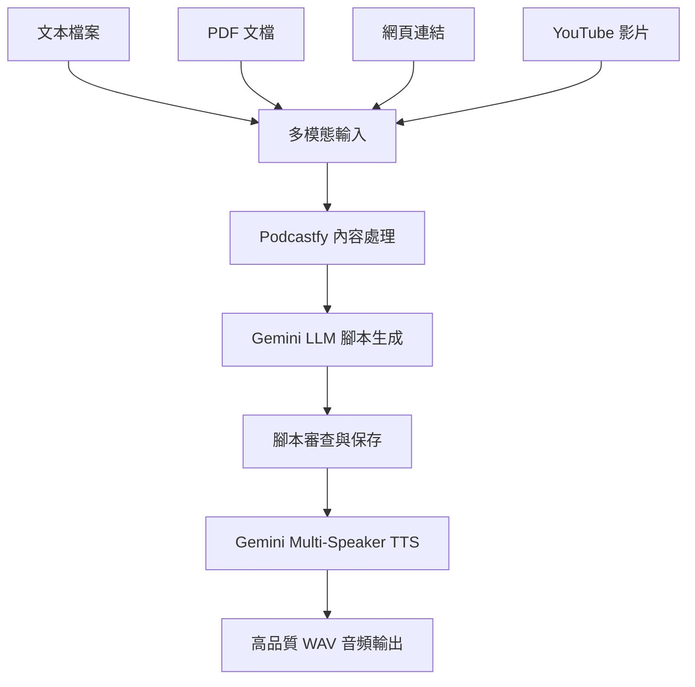

# 整合式播客生成器 - 工作流程文檔

## 📋 專案概述

本專案整合了 **Podcastfy** 和 **Gemini Multi-Speaker TTS**，建立了一個完整的播客生成工作流程：

1. **多模態輸入處理** → Podcastfy 處理各種內容格式
2. **智能腳本生成** → Gemini 2.5 Flash/Pro 生成高品質對話腳本  
3. **多說話者音頻** → Gemini Multi-Speaker TTS 生成自然語音

## 🔄 完整工作流程



## 📁 專案結構

```
podcastfy_test/
├── 🔧 核心組件
│   ├── integrated_podcast_generator.py    # 主要整合腳本
│   ├── english_podcast_generator.py       # Podcastfy 整合類
│   ├── generate_podcast.py               # 命令行介面
│   └── level_configs.py                  # CEFR 等級配置
│
├── 🧪 獨立測試工具
│   ├── gemini_direct_simple.py          # Gemini TTS 簡單測試
│   └── gemini_direct_podcast.py         # 直接 API 調用示例
│
├── 📋 配置與文檔
│   ├── .env                             # 完整環境配置
│   ├── requirements.txt                 # Python 依賴
│   ├── README.md                       # 基本說明
│   ├── README_USAGE.md                 # 使用指南
│   └── WORKFLOW_DOCUMENTATION.md       # 本文檔
│
├── 📊 數據與輸出
│   ├── data/                           # 測試數據
│   ├── integrated_output/              # 整合腳本輸出
│   └── sample_article.txt              # 測試文章
│
└── 🛠️ 環境與工具
    ├── venv/                           # Python 虛擬環境
    └── setup.sh                       # 環境設置腳本
```

## ⚙️ 核心配置 (.env)

### API 金鑰配置
```bash
GEMINI_API_KEY=your_gemini_api_key      # 主要 API
OPENAI_API_KEY=your_openai_key          # 備用（可選）
```

### 模型配置
```bash
# LLM 設定
DEFAULT_LLM_PROVIDER=gemini
GEMINI_LLM_MODEL=gemini-2.5-flash       # 避免配額限制
GEMINI_LLM_FALLBACK=gemini-2.5-pro      # 高品質備用

# TTS 設定  
DEFAULT_TTS_PROVIDER=gemini
GEMINI_TTS_MODEL=gemini-2.5-flash-preview-tts
GEMINI_HOST_VOICE=Kore                   # 主持人語音
GEMINI_EXPERT_VOICE=Puck                 # 專家語音
```

### 品質設定
```bash
DEFAULT_ENGLISH_LEVEL=B2                 # CEFR 等級
DEFAULT_TARGET_MINUTES=5                 # 目標長度
AUDIO_SAMPLE_RATE=24000                  # 高品質音頻
```

## 🚀 使用方式

### 1. 基本使用（整合腳本）

```python
from integrated_podcast_generator import IntegratedPodcastGenerator, IntegratedPodcastConfig

# 創建生成器
generator = IntegratedPodcastGenerator()

# 配置播客
config = IntegratedPodcastConfig(
    input_source="./article.txt",           # 或 PDF、URL、YouTube
    english_level="B2",                     # A1-C2
    target_minutes=5,                       # 播客長度
    host_voice="Kore",                      # Gemini 語音
    expert_voice="Puck"
)

# 生成播客
result = generator.generate(config)
```

### 2. 命令行使用

```bash
# 基本使用
python generate_podcast.py ./article.txt --level B2 --minutes 5

# 指定 TTS 提供者
python generate_podcast.py ./article.txt --level B2 --tts gemini

# 自定義指示
python generate_podcast.py ./article.txt --level B2 --instructions "Focus on practical examples"
```

### 3. 支援的輸入格式

| 格式 | 示例 | 描述 |
|------|------|------|
| 📄 文本檔案 | `./article.txt` | 純文本內容 |
| 📋 PDF 文檔 | `./document.pdf` | PDF 文件自動解析 |
| 🌐 網頁連結 | `https://example.com/article` | 網頁內容擷取 |
| 🎥 YouTube | `https://youtube.com/watch?v=...` | 影片轉錄分析 |

## 🎯 CEFR 等級支援

| 等級 | 詞彙複雜度 | 語速 | 對話風格 |
|------|------------|------|----------|
| **A1** | 基礎詞彙 | 慢速 | 教師-學生 |
| **A2** | 常用詞彙 | 慢速 | 教師-學生 |
| **B1** | 中級詞彙 | 正常 | 主持-專家 |
| **B2** | 進階詞彙 | 正常 | 主持-專家 |
| **C1** | 高級詞彙 | 快速 | 專業討論 |
| **C2** | 專業詞彙 | 快速 | 學術對話 |

## 🎵 Gemini TTS 語音選項

### 推薦組合
- **教育播客**: Kore (主持) + Puck (專家)
- **新聞播客**: Charon (主播) + Fenrir (分析師)  
- **輕鬆對話**: Aoede (主持) + Leda (嘉賓)

### 語音特性
| 語音 | 特性 | 適用角色 |
|------|------|----------|
| **Kore** | 堅定、清晰 | 主持人、老師 |
| **Puck** | 振奮、活潑 | 專家、學生 |
| **Charon** | 知識型、權威 | 新聞主播 |
| **Aoede** | 輕快、友好 | 輕鬆主持 |

## 📊 輸出結果

每次生成會創建一個時間戳目錄，包含：

```
integrated_output/podcast_B2_20240820_143022/
├── 📝 script.txt              # 生成的對話腳本
├── 🎵 podcast.wav            # 高品質音頻 (24kHz)
└── 📋 metadata.json          # 生成元數據
```

### 元數據示例
```json
{
  "timestamp": "20240820_143022",
  "input_source": "./article.txt",
  "input_type": "text",
  "english_level": "B2", 
  "target_minutes": 5,
  "host_voice": "Kore",
  "expert_voice": "Puck",
  "script_words": 742,
  "audio_size_kb": 521.3,
  "tts_provider": "gemini"
}
```

## 🔧 技術架構

### 核心組件

1. **IntegratedPodcastGenerator** - 主要整合類
   - 自動檢測輸入類型
   - 調用 Podcastfy 生成腳本  
   - 使用 Gemini TTS 生成音頻

2. **EnglishPodcastGenerator** - Podcastfy 專用類
   - CEFR 等級控制
   - 語速和複雜度調整
   - 對話結構優化

3. **level_configs.py** - 等級配置系統
   - 各等級詞彙限制
   - 語法複雜度控制
   - 對話風格定義

### API 整合

- **Podcastfy**: 多模態內容處理 + 腳本生成
- **Gemini 2.5 Flash**: 高效率 LLM（避免配額限制）
- **Gemini 2.5 Pro**: 高品質 LLM（備用）
- **Gemini Multi-Speaker TTS**: 多說話者音頻生成

## 🐛 故障排除

### 常見問題

1. **配額超限**: 
   - 使用 `gemini-2.5-flash` 而非 `gemini-2.5-pro`
   - 檢查 API 使用量

2. **音頻檔案過小**:
   - 檢查腳本內容是否完整
   - 確認 TTS 模型正確

3. **腳本品質不佳**:
   - 調整 `custom_instructions`
   - 使用更高等級的模型

### 除錯模式

在 `.env` 中啟用：
```bash
DEBUG_MODE=true
VERBOSE_LOGGING=true  
SAVE_API_RESPONSES=true
```

## 📈 效能優化

### 配額管理
- 優先使用 Flash 模型
- 批次處理多個請求
- 快取常用結果

### 品質提升  
- Pro 模型用於重要內容
- 自定義提示詞優化
- 多輪對話潤飾

## 🔮 未來擴展

### 計劃功能
- [ ] 批次處理多個檔案
- [ ] 更多語音角色組合
- [ ] 自動品質評估
- [ ] 播客系列生成
- [ ] 多語言支援

### 技術改進
- [ ] 非同步處理提升效率
- [ ] 更智能的內容分割
- [ ] 動態語音選擇
- [ ] 品質監控儀表板

---

## 📞 聯絡與支援

如有問題或建議，請查看：
- 📖 **README_USAGE.md** - 詳細使用說明
- 🧪 **gemini_direct_simple.py** - TTS 測試腳本
- 🔧 **setup.sh** - 環境設置指令

**主要維護者**: Claude Code Assistant  
**最後更新**: 2024-08-20