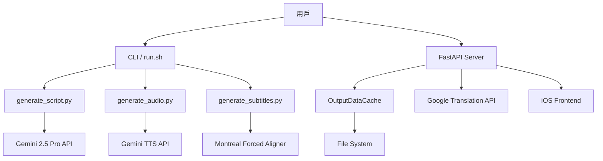

# 系統架構

Storytelling Backend 技術架構說明。

## 系統概覽



## 核心組件

### 1. CLI 層 (storytelling_cli)

**職責**: 交互式命令行界面

**關鍵模組**:
- `storytelling_cli/__main__.py`: 主入口，菜單系統
- `run.sh`: Shell 包裝器

**功能**:
- 書籍和章節管理
- 批次處理協調
- 狀態顯示
- 並行執行控制

### 2. 腳本生成層 (generate_script.py)

**職責**: 將章節文本轉換為播客腳本

**流程**:
```
源文件 (chapter.txt)
  ↓ 讀取並清理
章節內容 + 摘要
  ↓ 構建 Prompt
Gemini 2.5 Pro API
  ↓ 生成腳本
podcast_script.txt + metadata.json
```

**關鍵特性**:
- 六等級英語教學配置 (A1-C2)
- 前情回顧和下集預告
- 批次並行處理
- 詳細 metadata 輸出

### 3. 音頻生成層 (generate_audio.py)

**職責**: 腳本轉語音 + 自動字幕

**流程**:
```
podcast_script.txt
  ↓ 構建 TTS Prompt
Gemini TTS API
  ↓ 生成音頻 (PCM)
保存 WAV 文件
  ↓ 自動調用
Montreal Forced Aligner
  ↓ 詞級對齊
subtitles.srt
```

**關鍵特性**:
- 單人旁白 TTS
- 語速控制 (slow/neutral/fast)
- 批次並行處理
- 集成 MFA 字幕生成

### 4. 字幕生成層 (generate_subtitles.py)

**職責**: 詞級精準字幕對齊

**技術**: Montreal Forced Aligner (MFA)

**流程**:
```
podcast_script.txt + podcast.wav
  ↓ 準備 TextGrid 格式
MFA align (micromamba 環境)
  ↓ 強制對齊
詞級時間戳
  ↓ 轉換格式
subtitles.srt
```

**特點**:
- 毫秒級精度
- 詞級對齊（非句級）
- 避免估算導致的漂移

### 5. API 服務層 (server/app)

**職責**: RESTful API 服務

**框架**: FastAPI + Pydantic

**核心模組**:
- `main.py`: 路由定義
- `schemas.py`: 數據模型
- `services/`: 業務邏輯
  - `OutputDataCache`: 文件系統緩存
  - `TranslationService`: Google 翻譯集成
  - `TaskManager`: 後台任務管理

**特性**:
- ETag 緩存驗證
- 範圍請求支持（音頻流）
- CORS 支持
- GZip 壓縮
- 管理員認證

## 數據流

### 完整生成流程

```
1. 準備階段
   data/foundation/chapter0.txt (源文件)
   ↓ preprocess_chapters.py (可選)
   data/foundation/summaries/chapter0_summary.txt

2. 腳本生成
   源文件 + 摘要 + 配置
   ↓ generate_script.py
   output/foundation/chapter0/podcast_script.txt
   output/foundation/chapter0/metadata.json

3. 音頻生成
   podcast_script.txt + 配置
   ↓ generate_audio.py
   output/foundation/chapter0/podcast.wav
   ↓ (自動調用 MFA)
   output/foundation/chapter0/subtitles.srt

4. API 服務
   output/foundation/ (所有文件)
   ↓ OutputDataCache 掃描
   FastAPI 端點
   ↓ HTTP/JSON
   Frontend App
```

## 配置系統

### 配置層級

```
1. YAML 配置 (podcast_config.yaml)
   - 基本設置 (english_level, episode_length)
   - 路徑配置
   - 書籍覆寫設置
   - 敘事風格
   - MFA 設置

2. 環境變量 (.env)
   - GEMINI_API_KEY (必需)
   - GOOGLE_TRANSLATE_* (可選)
   - 批次處理參數

3. 命令行參數
   - --config: 配置文件路徑
   - --book-id: 書籍 ID
   - --force: 強制重新生成
```

## 並行處理策略

### 腳本生成並行

```python
# storytelling_cli/__main__.py
with ThreadPoolExecutor(max_workers=batch_size) as executor:
    futures = {executor.submit(generate_script, chapter): chapter
               for chapter in chapters}
    for future in as_completed(futures):
        result = future.result()  # 處理結果
```

**優點**:
- 充分利用 API 並發
- 批次控制防止過載

### 音頻生成並行

類似腳本生成，但批次大小較小（默認 5）

**原因**:
- TTS API 較慢
- 包含 MFA 對齊（CPU 密集）

### 字幕生成串行

```python
for chapter in chapters:
    generate_subtitles(chapter)  # 串行執行
```

**原因**:
- MFA 是 CPU/GPU 密集型
- 避免資源競爭

## 緩存策略

### OutputDataCache

**實現**: 文件系統掃描 + 內存緩存

```python
class OutputDataCache:
    def __init__(self, data_root):
        self.data_root = Path(data_root)
        self._books_cache = {}  # 內存緩存

    def get_books(self):
        # 掃描文件系統
        # 解析 metadata.json
        # 構建 BookData 對象
        return self._books_cache
```

**緩存粒度**:
- 書籍級別
- 章節級別

**刷新策略**:
- 懶加載
- 按需刷新

### 翻譯緩存

**實現**: LRU Cache

```python
@lru_cache(maxsize=256)
def translate(text, target_lang, source_lang):
    # 調用 Google Translation API
    return result
```

## 依賴管理

### 核心依賴

```
google-genai (Gemini API)
  ↓
Gemini 2.5 Pro (腳本) + Gemini TTS (音頻)

pydantic (數據驗證)
pyyaml (配置解析)
python-dotenv (環境變量)
```

### 服務器依賴

```
fastapi (Web 框架)
uvicorn (ASGI 服務器)
google-cloud-translate (翻譯)
```

### 系統依賴

```
micromamba
  ↓
Montreal Forced Aligner (conda 環境)
  ↓
詞級字幕對齊
```

## 錯誤處理

### API 錯誤

```python
try:
    result = gemini_client.generate_content(prompt)
except APIError as e:
    logger.error(f"Gemini API 錯誤: {e}")
    # 重試邏輯
    # 或記錄失敗
```

### 文件系統錯誤

```python
if not chapter_file.exists():
    raise FileNotFoundError(f"找不到章節: {chapter_file}")
```

### MFA 錯誤

```python
try:
    result = subprocess.run([mfa_cmd, ...], check=True)
except subprocess.CalledProcessError as e:
    raise MfaAlignmentError(f"MFA 對齊失敗: {e}")
```

## 性能考量

### 瓶頸分析

1. **API 調用** (最大瓶頸)
   - Gemini API 延遲 ~2-5 秒/請求
   - 解決方案：批次並行

2. **MFA 對齊** (CPU 密集)
   - 處理時間 ~1-3 分鐘/章節
   - 解決方案：串行處理避免競爭

3. **文件 I/O**
   - 影響較小
   - 使用緩存優化

### 優化策略

- ✅ API 並行調用
- ✅ 批次處理控制
- ✅ 延遲參數調整
- ✅ 結果緩存
- ✅ 懶加載

## 可擴展性

### 水平擴展

```
多個 CLI 進程 → 處理不同書籍
多個 API 服務器 → 負載均衡
```

### 功能擴展點

1. **任務隊列** (Celery)
   - 異步任務處理
   - 任務調度

2. **多語言支持**
   - 添加新的語言級別
   - 多語言 TTS

3. **插件系統**
   - 自定義腳本生成器
   - 自定義音頻處理器

## 安全考慮

### API Key 管理

- 使用 `.env` 文件
- 不提交到 Git
- 環境變量注入

### 文件訪問

- 路徑驗證
- 防止目錄遍歷

### API 認證

- Bearer Token
- 管理端點保護

## 下一步

- 查看 [配置指南](../setup/configuration.md) 了解配置細節
- 查看 [API 參考](../api/reference.md) 了解 API 設計
- 查看 [貢獻指南](contributing.md) 了解如何參與開發
