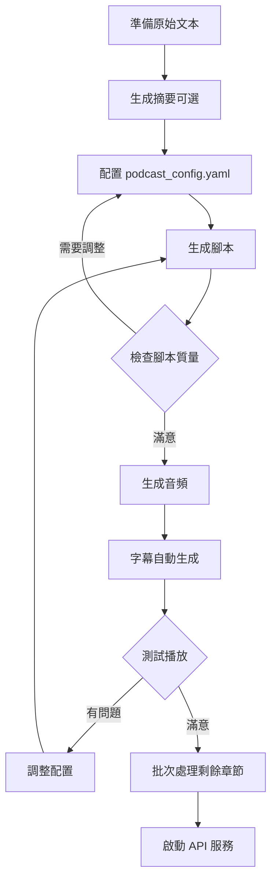

# 工作流程指南

推薦的播客生成工作流程和最佳實踐。

## 完整工作流程



## 第一次使用

### Step 0: 準備環境

```bash
# 1. 確認環境已安裝
source .venv/bin/activate
python test_api.py  # 測試 API 連接

# 2. 確認 MFA 已設置
micromamba run -n aligner mfa version
```

### Step 1: 準備書籍文件

**目錄結構：**
```
data/
└── your-book/           # 建立書籍資料夾
    ├── chapter0.txt
    ├── chapter1.txt
    ├── chapter2.txt
    └── ...
```

**文件準備檢查清單：**
- ✅ 文件名符合 `chapter*.txt` 模式
- ✅ 文件編碼為 UTF-8
- ✅ 每個文件至少 100 個單詞
- ✅ 清除不必要的空行和特殊字符

### Step 2: 配置系統

```yaml
# podcast_config.yaml
basic:
  english_level: "intermediate"  # 根據目標受眾選擇
  episode_length: "medium"        # 先用 medium 測試
  narrator_voice: "Aoede"         # 選擇喜歡的聲音
  start_chapter: 1                # 從第 1 章開始
  chapters_per_run: 1             # 先測試單章

books:
  overrides:
    your-book:                    # 添加書籍配置
      display_name: "Your Book Title"
```

### Step 3: 生成測試章節

**目的：** 在批次處理前驗證配置是否符合預期。

```bash
./run.sh

# 1. 選擇書籍
> 6
> [選擇您的書籍]

# 2. 生成單個摘要（可選）
> 4
> 1
> 1
> n

# 3. 生成單個腳本
> 1
> 0    # 生成第一章

# 4. 檢查腳本
cat output/your-book/chapter0/podcast_script.txt

# 5. 如果滿意，生成音頻
> 2
> 0

# 6. 試聽
> 5
> 0
```

### Step 4: 調整配置（如果需要）

根據測試結果調整：

**腳本太短：**
```yaml
basic:
  episode_length: "long"  # 改為 long
```

**語速太快：**
```yaml
basic:
  speaking_pace: "slow"   # 改為 slow
```

**內容太簡單：**
```yaml
basic:
  english_level: "advanced"  # 提升等級
```

### Step 5: 批次處理

確認配置後，批次處理所有章節：

```bash
./run.sh

# 1. 生成所有摘要（推薦）
> 4
> 1
> [Enter]  # 全部章節
> n        # 不覆寫

# 2. 批次生成所有腳本
> 1
> all

# 3. 批次生成所有音頻
> 2
> all
```

## 推薦工作流程

### 方案 A: 全新書籍（完整流程）

```bash
# 時間估計：10 章約 2-3 小時

# 1. 準備
data/new-book/chapter0.txt ~ chapter9.txt

# 2. 配置
vim podcast_config.yaml

# 3. 測試單章
./run.sh → 1 → 0    # 腳本
./run.sh → 2 → 0    # 音頻
./run.sh → 5 → 0    # 試聽

# 4. 調整並確認

# 5. 批次處理
./run.sh → 4 → all  # 摘要
./run.sh → 1 → all  # 腳本
./run.sh → 2 → all  # 音頻

# 6. 啟動服務
uvicorn server.app.main:app --reload
```

### 方案 B: 增量添加章節

```bash
# 已有 chapter0-9，現在添加 chapter10-14

# 1. 添加新文件
data/foundation/chapter10.txt ~ chapter14.txt

# 2. 只處理新章節
./run.sh → 4 → 10-14  # 摘要
./run.sh → 1 → 10-14  # 腳本
./run.sh → 2 → 10-14  # 音頻
```

### 方案 C: 更新現有章節

```bash
# 修改了 chapter3 的源文件，需要重新生成

# 1. 刪除舊輸出
rm -rf output/foundation/chapter3

# 2. 重新生成
./run.sh → 4 → 3      # 摘要（如果源文件改變）
./run.sh → 1 → 3      # 腳本
./run.sh → 2 → 3      # 音頻（會自動生成字幕）
```

### 方案 D: 只重新生成字幕

```bash
# 音頻沒問題，但字幕需要更新

./run.sh → 3 → 0-9   # 重新生成所有字幕
```

## 批次處理策略

### 小批次策略（推薦新手）

**優點：**
- 及早發現問題
- 易於調整
- 資源消耗平穩

**配置：**
```bash
export PODCAST_SCRIPT_BATCH_SIZE=3
export PODCAST_AUDIO_BATCH_SIZE=2
export PODCAST_SCRIPT_BATCH_DELAY=10
export PODCAST_AUDIO_BATCH_DELAY=60
```

**使用：**
```bash
# 分 3-4 批處理 10 章
./run.sh → 1 → 0-2
./run.sh → 1 → 3-5
./run.sh → 1 → 6-9

# 檢查後再處理音頻
```

### 大批次策略（適合熟練用戶）

**優點：**
- 一次性完成
- 節省操作時間

**風險：**
- 配置錯誤影響範圍大
- API 限制風險
- 資源消耗峰值

**配置：**
```bash
export PODCAST_SCRIPT_BATCH_SIZE=20
export PODCAST_AUDIO_BATCH_SIZE=10
export PODCAST_SCRIPT_BATCH_DELAY=15
export PODCAST_AUDIO_BATCH_DELAY=90
```

### 混合策略（推薦）

```bash
# 1. 小批次測試（章節 0-2）
./run.sh → 1 → 0-2
./run.sh → 2 → 0-2

# 2. 驗證結果
./run.sh → 5 → 0,1,2

# 3. 大批次處理剩餘（章節 3-19）
export PODCAST_SCRIPT_BATCH_SIZE=15
./run.sh → 1 → 3-19
./run.sh → 2 → 3-19
```

## 質量控制

### 腳本質量檢查

```bash
# 檢查要點：
# 1. 長度是否合適
wc -w output/foundation/chapter0/podcast_script.txt

# 2. 是否有語言提點
grep -i "which means\|that is when\|in other words" \
  output/foundation/chapter0/podcast_script.txt

# 3. 是否有前情回顧
grep -i "in the previous\|last time" \
  output/foundation/chapter0/podcast_script.txt

# 4. 檢查 metadata
cat output/foundation/chapter0/metadata.json
```

### 音頻質量檢查

```bash
# 1. 試聽開頭 30 秒
ffplay -t 30 output/foundation/chapter0/podcast.wav

# 2. 檢查音頻長度
ffprobe output/foundation/chapter0/podcast.wav 2>&1 | grep Duration

# 3. 檢查字幕同步
./run.sh → 5 → 0  # 播放並觀察字幕
```

### 字幕質量檢查

```bash
# 1. 檢查字幕格式
head -20 output/foundation/chapter0/subtitles.srt

# 2. 檢查字幕數量
grep -c "^[0-9]*$" output/foundation/chapter0/subtitles.srt

# 3. 檢查時間戳
grep --color=always "[0-9][0-9]:[0-9][0-9]:[0-9][0-9]" \
  output/foundation/chapter0/subtitles.srt | head
```

## 常見工作場景

### 場景 1: 製作教學播客系列

**目標：** 為英語學習者製作系統化課程

**配置：**
```yaml
basic:
  english_level: "beginner"      # 初學者
  episode_length: "medium"        # 標準長度
  speaking_pace: "slow"           # 慢速
  chapters_per_run: 1             # 單章確保質量

storytelling:
  english_levels:
    beginner:
      explanation_style: "Explain new words naturally..."
      recap_style: "At the end of every segment, recap..."
```

**流程：**
```bash
# 1. 精心準備每個章節
# 2. 逐章生成並檢查
# 3. 確保每集都有詳細的語言解釋
# 4. 保持一致的教學節奏
```

### 場景 2: 快速內容製作

**目標：** 快速生成大量內容

**配置：**
```yaml
basic:
  english_level: "advanced"       # 減少解釋
  episode_length: "short"         # 短篇
  speaking_pace: "fast"           # 快速
  chapters_per_run: 3             # 批次處理

# 使用大批次設置
export PODCAST_SCRIPT_BATCH_SIZE=20
export PODCAST_AUDIO_BATCH_SIZE=10
```

**流程：**
```bash
# 1. 批次生成所有腳本
./run.sh → 1 → all

# 2. 抽檢 20% 章節質量
# 3. 批次生成所有音頻
./run.sh → 2 → all
```

### 場景 3: 高質量精品製作

**目標：** 製作高質量的文學分析播客

**配置：**
```yaml
basic:
  english_level: "advanced"
  episode_length: "long"
  speaking_pace: "neutral"
  narrator_voice: "Aoede"

storytelling:
  creativity: 0.7                 # 提高創意度
  tone: ["immersive", "thoughtful", "analytical"]
```

**流程：**
```bash
# 1. 逐章處理
# 2. 人工審核每個腳本
# 3. 必要時手動調整
# 4. 多次試聽確認質量
```

## 性能優化

### 加速腳本生成

```bash
# 1. 使用並行處理
export PODCAST_SCRIPT_BATCH_SIZE=15

# 2. 減少延遲（注意 API 限制）
export PODCAST_SCRIPT_BATCH_DELAY=5

# 3. 確保摘要已預先生成
./run.sh → 4 → all
```

### 加速音頻生成

```bash
# 1. 適度並行
export PODCAST_AUDIO_BATCH_SIZE=5

# 2. 確保腳本已全部生成
./run.sh → 1 → all

# 3. 使用後台處理（高級）
nohup ./run.sh &
# 然後選擇: 2 → all
```

### 節省磁盤空間

```yaml
# podcast_config.yaml
alignment:
  mfa:
    keep_intermediate: false    # 不保留中間文件
    keep_workdir: false         # 不保留工作目錄
```

```bash
# 定期清理
rm -rf .mfa_work/
rm -rf output/*/chapters/*/temp/
```

## 錯誤恢復

### 批次處理中斷

```bash
# 檢查已完成的章節
./run.sh → r

# 只處理未完成的
./run.sh → 1 → [查看表格，選擇未完成的範圍]
```

### API 限制錯誤

```bash
# 1. 增加延遲
export PODCAST_SCRIPT_BATCH_DELAY=30
export PODCAST_AUDIO_BATCH_DELAY=120

# 2. 減小批次
export PODCAST_SCRIPT_BATCH_SIZE=5
export PODCAST_AUDIO_BATCH_SIZE=2

# 3. 等待後重試
sleep 300  # 等待 5 分鐘
./run.sh → 1 → [失敗的範圍]
```

### 字幕生成失敗

```bash
# 1. 檢查 MFA 環境
micromamba run -n aligner mfa version

# 2. 清理並重新生成
rm output/foundation/chapter0/subtitles.srt
./run.sh → 3 → 0

# 3. 如果持續失敗，檢查配置
vim podcast_config.yaml
# 確認 micromamba_bin 路徑正確
```

## 時間規劃

### 單章節時間估計

| 步驟 | 時間 | 備註 |
|------|------|------|
| 準備文本 | 5-10 分鐘 | 手動準備 |
| 生成摘要 | 30-60 秒 | API 調用 |
| 生成腳本 | 1-3 分鐘 | API 調用 |
| 生成音頻 | 2-5 分鐘 | TTS + 處理 |
| 生成字幕 | 1-3 分鐘 | MFA 對齊 |
| **總計** | **10-20 分鐘** | 單章完整流程 |

### 10 章節批次時間估計

```
準備: 1 小時
摘要: 5-10 分鐘
腳本: 15-30 分鐘
音頻: 30-60 分鐘
字幕: 自動（包含在音頻中）
質量檢查: 30 分鐘
總計: 約 2.5-3.5 小時
```

## 下一步

- 查看 [CLI 使用指南](cli-guide.md) 了解詳細命令
- 查看 [配置指南](../setup/configuration.md) 優化設置
- 查看 [API 文檔](../api/reference.md) 集成前端
- 查看 [故障排除](../operations/troubleshooting.md) 解決問題

## 最佳實踐總結

✅ **DO**
- 先測試單章再批次處理
- 使用摘要功能提升質量
- 定期備份重要輸出
- 保持一致的配置
- 記錄調整歷史

❌ **DON'T**
- 不要跳過測試階段
- 不要使用過大的批次
- 不要忽略 API 限制
- 不要手動修改輸出文件
- 不要在處理中修改配置

## 需要幫助？

- 📖 查看 [故障排除指南](../operations/troubleshooting.md)
- 💬 [討論最佳實踐](https://github.com/your-org/storytelling-backend/discussions)
- 🐛 [報告問題](https://github.com/your-org/storytelling-backend/issues)
